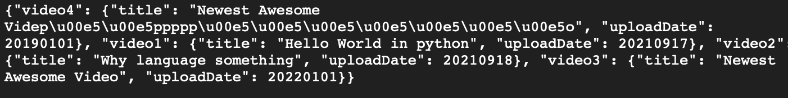

# Flask REST API

## A minimal RESTful API built with Flask and Flask-RESTful for managing a simple video catalogue.

### Features

- REST-style endpoints using HTTP verbs (GET, POST, PUT, DELETE)
- JSON- and form-based request handling
- Persistent storage using a local JSON file
- Basic input validation and error handling
- Simple resource-oriented API design

### Files

- rest_api.py – Flask REST API implementation
- videos.json – Persistent storage for video metadata

## API Overview

### GET

- /videos/all – Retrieve all videos
- /videos/<video_id> – Retrieve a single video

### POST

- /videos – Create a new video entry

### PUT

- /videos/<video_id> – Create or update a video

### DELETE

- /videos/<video_id> – Delete a video

### Each video contains:

- title (string, required)
- uploadDate (integer, optional)

# Purpose

This project demonstrates:

- Basic REST API design
- HTTP request handling in Flask
- Stateless services with simple persistence
- Foundational backend concepts relevant to larger web systems

Note: This is an educational example and not intended for production use.

## Notes (Ignore)

Terminal output:
bruker@MacBook-Pro-2 ~ % curl -4 http://localhost:5000/videos
{"video1": {"title": "Hello World in python", "uploadDate": 20210917}, "video2": {"title": "Why language something", "uploadDate": 20210918}}
bruker@MacBook-Pro-2 ~ % curl -4 http://localhost:5000/videos -d "title=Newest Awesome Video" -d "uploadDate=20220101" -X POST
{"video3": {"title": "Newest Awesome Video", "uploadDate": 20220101}}
bruker@MacBook-Pro-2 ~ % curl -4 http://localhost:5000/videos -d "title=Newest Awesome Videpååpppppåååååååo" -d "uploadDate=20190101" -X POST
{"video4": {"title": "Newest Awesome Videp\u00e5\u00e5ppppp\u00e5\u00e5\u00e5\u00e5\u00e5\u00e5\u00e5o", "uploadDate": 20190101}}
bruker@MacBook-Pro-2 ~ % curl -4 http://localhost:5000/videos
{"video4": {"title": "Newest Awesome Videp\u00e5\u00e5ppppp\u00e5\u00e5\u00e5\u00e5\u00e5\u00e5\u00e5o", "uploadDate": 20190101}, "video1": {"title": "Hello World in python", "uploadDate": 20210917}, "video2": {"title": "Why language something", "uploadDate": 20210918}, "video3": {"title": "Newest Awesome Video", "uploadDate": 20220101}}
bruker@MacBook-Pro-2 ~ %

## Look at videos.json for output

## 127.0.0.1:5000/videos/all

